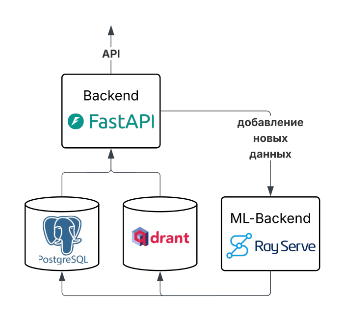

# Система поиска релевантных кандидатов

Данный проект представляет собой исследовательскую работу, направленную на разработку системы для оптимизации процессов рекрутинга и трудоустройства с использованием методов машинного обучения и нейронных сетей. Основная цель — создание эффективного инструмента для сопоставления кандидатов с вакансиями.

### Ключевые особенности

- Семантический поиск кандидатов с использованием эмбеддинговых моделей
- Учет бизнес-процессов в сфере рекрутинга при разработке алгоритмов
- Система фильтрации и ранжирования резюме с учетом опыта кандидатов

## Структура проекта

```
.
├── research/         # Исследовательский код
├── plots/            # Графики и визуализации
├── main.tex          # Основной файл работы
```

## Стек приложения



